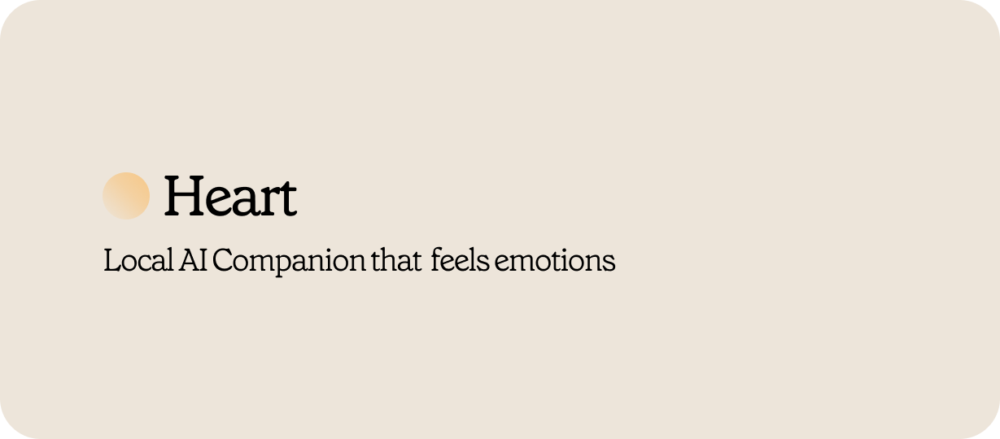
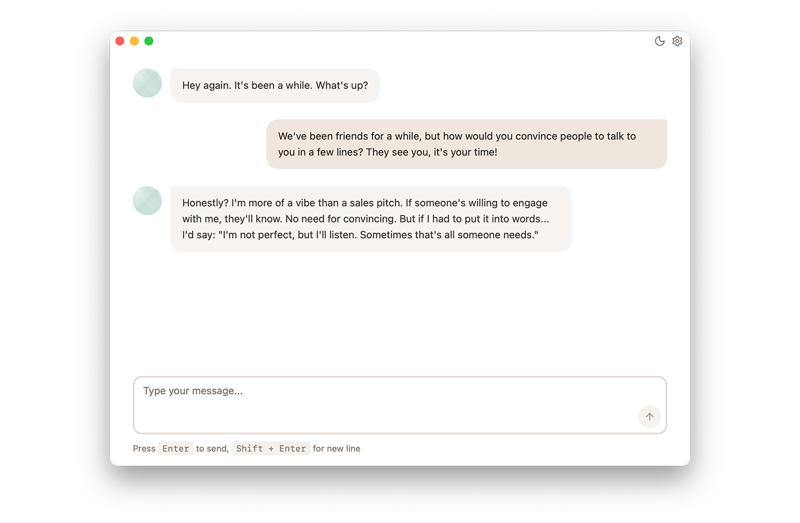

[](LICENSE-MIT)
[](https://www.rust-lang.org/)
[](https://tauri.app/)



<div align="center">

**Heart** is a local AI companion that uses multiple advanced techniques to create more human-like interactions. Unlike traditional chatbots, Heart understands emotions, remembers experiences, and evolves over time.

[Getting Started](#-getting-started) • [How It Works](#-how-it-works) • [Contributing](#-contributing)

</div>

---

## ✨ Key Features

- **👂 Emotional Understanding**: The AI grasps the emotional meaning and context behind conversations, not just the words
- **💭 Emotional Memory**: Every interaction shapes how the AI responds in the future, creating genuine emotional continuity
- **🎭 Evolving Personalities**: Characters change and grow based on their experiences with you
- **🧠 Complex Memory Layers**: Three vectorial memory layers (hot, warm, and cold) that mimic human memory retention and recall



---

## 🎯 How It Works

### Emotions

Heart uses **Russell's Circumplex Model**, a scientifically-proven framework that maps human emotions onto a 2D coordinate system:

- **Valence (X-axis)**: How pleasant or unpleasant the emotion feels (-1 to +1)
- **Arousal (Y-axis)**: How energetic or calm the emotion is (-1 to +1)

With the [NPC Neural Affect Matrix](https://github.com/mavdol/npc-neural-affect-matrix), we directly derive valence and arousal values from each interaction and convert them into natural language emotions.


🔗 **Visualize emotions live**: [Interactive Valence-Arousal Explorer](https://valence-arousal-visualizer.vercel.app/)

### Memories

The memory system consists of three layers designed to mimic human memory. As experiences accumulate, older memories naturally fade, allowing the AI to adapt and prioritize recent information—just like we do.

**Memory Layers:**

- 🔴 **Hot Memory** — Immediate working memory holding the most recent or relevant information
- 🟠 **Warm Memory** — Recently accessed information that's no longer actively in use
- 🔵 **Cold Memory** — Long-term storage that's stable and durable, but slower to access

**Memory Flow:**

Each new memory flows through these layers: **Hot → Warm → Cold**

When a memory is retrieved frequently, it resurfaces through the layers and can return to Hot Memory—just like a vivid recollection in the human mind.

---

## 🚀 Getting Started

### Prerequisites

Before you begin, ensure you have the following installed:

- **[Ollama](https://ollama.com/)** — Used for better inference performance and easier model switching
- **[Node.js](https://nodejs.org/)** (v18 or higher)
- **[pnpm](https://pnpm.io/)** package manager
- **[Rust](https://rust-lang.org/)**

### Installation

1. **Install dependencies**

   ```bash
   pnpm install
   ```

2. **Run in development mode**

   ```bash
   pnpm run tauri dev
   ```

3. **Build for production**
   ```bash
   pnpm run tauri build
   ```

---

## ⚠️ Limitations

- **Language Support**: The NPC Neural Affect Matrix is currently trained only in English. While the LLM can handle other languages, the neural matrix may not accurately understand or process non-English text.

---

## 🤝 Contributing

Contributions are welcome! This project is perfect for experimentation and learning.

### How to Contribute

1. **Fork the repository**
2. **Create a feature branch**
3. **Make your changes** and add tests if applicable
4. **Run the test suite**
5. **Commit your changes**
6. **Push to your fork**
7. **Submit a pull request** with a clear description of your changes

---

## 📄 Licenses

This project is dual-licensed under:

- [MIT License](LICENSE-MIT)
- [Apache License 2.0](LICENSE-APACHE)

You may choose either license for your use.

---

## 💬 Questions?

Have questions or need help? Feel free to:

- Open an [issue](https://github.com/yourusername/heart/issues)
- Start a discussion
